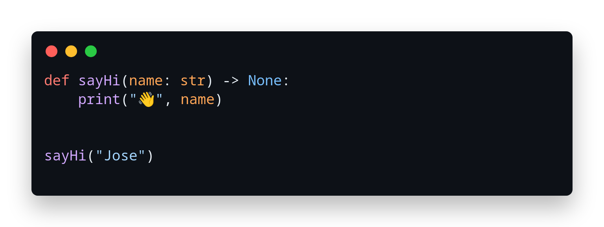

# Python Made Easy

Master Programming Language with Python

## Table of Content

**Topics:**

- [Getting Started](./getting-started.md)

- [Primitive Types](./primitive-types.md)

- Control Flow

- Functions

- Data Structures

- Exceptions

- Classes

- Modules

- Python Standard Library

- Python Package Index

- Popular Python Packages

**Projects:**

- Building Web Applications with Django
- Machine Learning with Python
