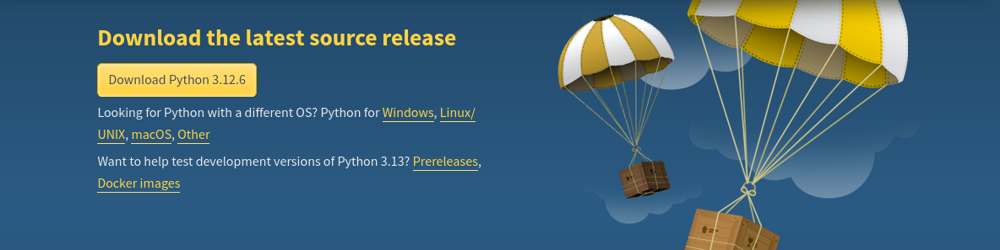
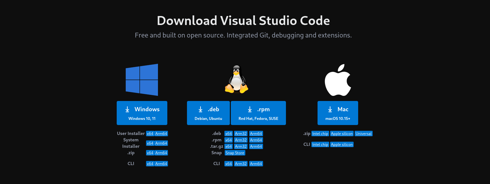
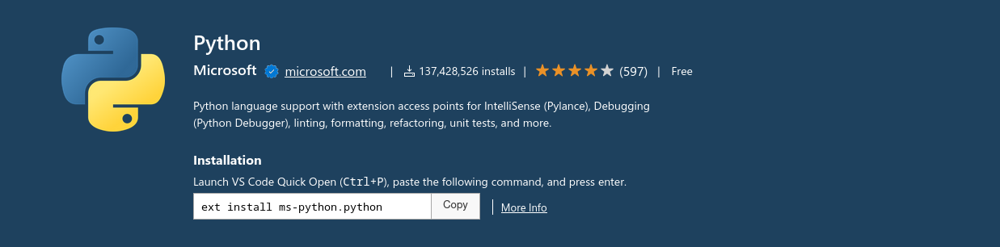

# Programming with Python

## Getting Started

Python is one of the post popular, fast growing programming language

### Why Learn Python

1. **Clean and simple**: You can solve complex problems in less time with fewer lines of code than many other languages.

2. **Multi-purpose**: You can use it for a wide range of jobs such as Machine Learning, Data Analysis, Automation, Web Development, Hacking etc.

3. **High-level**: You don't have to worry about complex tasks such as memory management.

4. **Huge Community**: Easy to get help whenever you stack

5. **Cross-platform**: You can build and run Python apps on windows, mac and linux.

6. **Large Ecosystem**: You can find libraries, frameworks and tools for anything you want to do.

### Setup Development Environment

- Download and install latest version of Python for your operating system.

  [](https://www.python.org/downloads/)

- Check if you have installed Python properly

  ```sh
  > python --version
  Python 3.12.5
  ```

- Download and install latest version code editor for your operating system.

  [](https://code.visualstudio.com/)

- Download and install Python extension for Visual Studio Code to get features such as linting, bugging, autocompletion, code formatting, unit testing and code snippets.

  [](https://marketplace.visualstudio.com/items?itemName=ms-python.python)

### Python Interpreter

- Python interpreter is a program that execute python code.
- To execute python code you can either type directly into an interactive shell or type the python code in a file with .py extension and give it to the interpreter.
- Instruction in a python program are executed in order from top to bottom.

### First Python Program

- Create a new file with `.py` extension. Call a `print()` function to print a _"Hello World 😺"_ message to a console and save the changes

  ```py
  # app.py
  print("Hello World 😺")
  ```

- To run python code, open the terminal and type python followed by the name of the file

  ```sh
  > python app.py
  Hello World 😺
  ```

### Python Implementation

- **cPython**: written in C (default)
- **Jython**: written in Java
- **IronPython**: written in C#
- **PyPy**: written in subset of Python itself

`NOTE`: These implementations allow us to reuse some existing code from a particular language in Python program

- For example, Use Jython to import some Java code in your Python program instead of cPython.

### How Python Code is Executed

Computer only understand machine code not python code. Therefore to execute python code the  following steps are followed in order.

1. If we run a Python program using cPython, it will first compile `Python source code` into `Python byte code`.
2. Then, it will pass that Python `byte code` into `Python Virtual Machine` which will in turn convert it into `machine code`
3. Finally, execute it

`NOTE`: Jython will instead compile python source code into `Java byte code`. Then, use Java Virtual Machine to convert it into `Machine code` and execute it.
